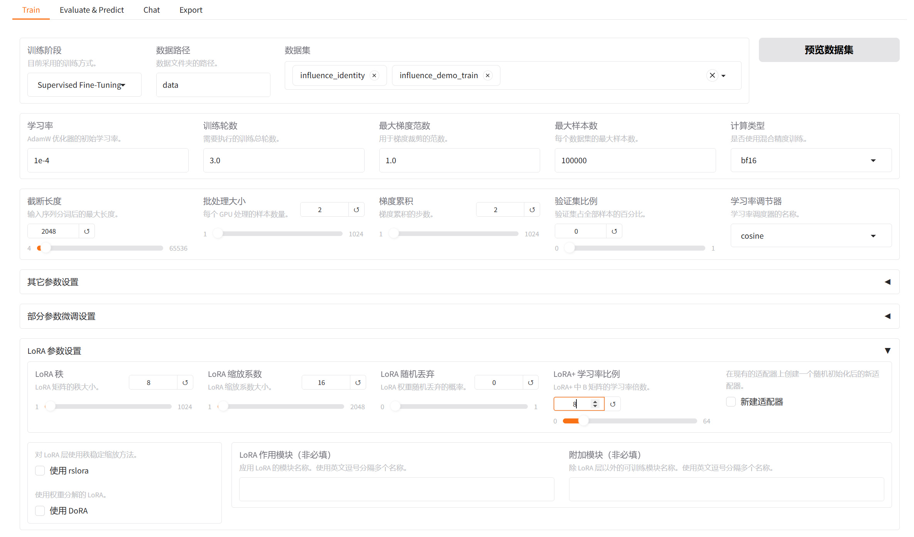
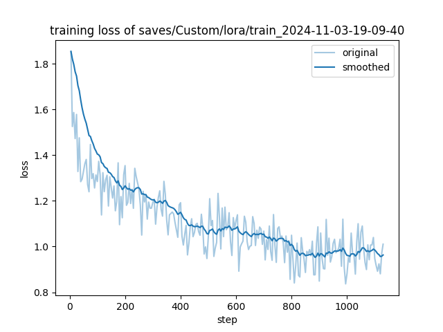

## 影响力
### 本地部署
依赖：
- node.js 16.20.2
- MySql 5.7.24

前端：
- 在终端中打开`CinemaManagerUserVue` 或 `CinemaManagerAdminVue`，执行`npm install`
- 下载完依赖项后，执行`npm run serve`，即可看到前端的入口：
```
  App running at:
  - Local:   http://localhost:9232/ 
  - Network: http://192.168.1.107:9232/
```
> 如果此前由较高版本的 node.js 降级到 16，可能会出现有关 openssl 的问题。
> 对于单次运行的解决方法，可在对应命令行中执行：
```
MacOS/Linux
export NODE_OPTIONS=--openssl-legacy-provider

Windows
set NODE_OPTIONS=--openssl-legacy-provider
```

后端：
- 新建数据库`cinema_manager`，导入`CinemaManagerApi/cinema_manager.sql`
- 在`CinemaManagerApi/src/main/resources/application.yml`中修改数据库的用户名与密码
- 确保数据库已连接，运行`CinemaManagerApi/src/main/java/com/influence/cm/CinemaManagerApplication.java`
- 此时终端若无报错，前端页面应正常显示电影封面等数据

模型部署：
基座模型为 [Qwen2.5-7B-Instruct](https://modelscope.cn/models/Qwen/Qwen2.5-7B-Instruct/summary),`InfluenceAgent/lora`中提供 safetensor 格式的 lora 权重。

- 提供量化后的 gguf 格式的模型权重，只用 CPU 也可以在本地使用 [llama.cpp](https://github.com/ggerganov/llama.cpp) 进行部署
  | 模型 | 大小 | 下载链接
  | :- | :- | :- |
  | InfluenceAgent-Q2_K.gguf | 2.8GB | [地址](https://dsw-gateway-cn-shanghai.data.aliyun.com/dsw-470222/files/llama.cpp/models/influence_agent/InfluenceAgent-Q2_K.gguf?_xsrf=2%7Cc7d391fd%7Cf9b1616a5ebf605330d7c9e75bc2ceb9%7C1733577133) |
  | InfluenceAgent-Q4_K_M.gguf | 4.4GB | [地址](https://dsw-gateway-cn-shanghai.data.aliyun.com/dsw-470222/files/llama.cpp/models/influence_agent/InfluenceAgent-Q4_K_M.gguf?_xsrf=2%7Cc7d391fd%7Cf9b1616a5ebf605330d7c9e75bc2ceb9%7C1733577133) |
- 提供已编译好的 llama.cpp 多平台可执行文件，见`InflenceAgent/llama.cpp/build/bin/{your_environment}`。进入该目录，启动模型服务指令为：
  ```
  ./llama-server -m <gguf_model_path> -c 2048 --port 8080 
  ```
  > `InfluenceAgent/models`中提供的模型已经合并了 lora 权重，无需使用`--lora`重复加载
- 该服务满足 OpenAI 接口格式，但没有鉴权（可使用`--api-key`设置），在`CinemaManagerUserVue/src/components/AiChatBox.vue`中`http://localhost:8080/v1/chat/completions`改为对应的 IP 及端口号，即可在主页正常进行与影响力智能影院助手的对话
- 如果只是想在本地命令行中进行测试，可以使用`llama-cli`，参考指令如下：
  ```
  ./llama-cli -m <gguf_model_path> -p "你好，我是影响力智能影院助手，为你提供电影问答与推荐服务～！" -cnv
  ```

### 模型微调
基座模型采用 Qwen2.5-7B-Instruct，使用 alpaca 格式的 `InfluenceAgent/data`中的`influence_identity.json`及`influence_demo_train.json`作为训练集，`influence_demo_test.json`为验证集。

合成数据的获取方式见`InfluenceAgent/make_dataset.ipynb`。

微调平台为阿里云 DSW 开发环境，使用 [LLaMa_Factory]() 进行 lora 微调，环境配置与参数设置参考：https://help.aliyun.com/zh/pai/use-cases/fine-tune-a-llama-3-model-with-llama-factory

微调参数设置：


微调 loss 可视化：


微调后在验证集上的结果：
| ROUGE-1 | ROUGE-2 | ROUGE-L |
| :-: | :-: | :-: |
| 39.8 | 22.6 | 37.5 |